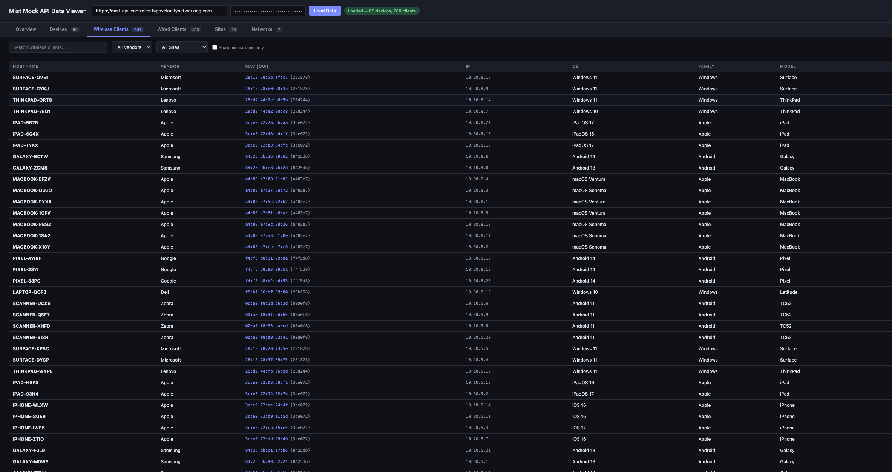

# Mock Juniper Mist API

A fully-functional mock implementation of the Juniper Mist Cloud API, designed for **Infoblox Universal DDI** integration testing and demos.

## Overview

This project provides a serverless mock Mist API that returns realistic network infrastructure data including organizations, sites, devices, networks, clients, and maps. Perfect for:

- **Infoblox Universal DDI Portal** testing with Third Party IPAM providers
- Demo environments without requiring real Mist infrastructure
- Development and integration testing
- Training and educational purposes

## Infoblox Integration Workflow

```
┌──────────────────────────────────────┐
│     Infoblox Universal DDI Portal    │
│                                      │
│  Configure → Networking → Discovery  │
│  → Third Party IPAM → Mist          │
└──────────────────┬───────────────────┘
                   │
                   │  HTTPS REST API Calls
                   │  Authorization: Token <your-key>
                   │
                   ▼
┌──────────────────────────────────────────────────────────────────┐
│                                                                  │
│   https://mist-api-controller.highvelocitynetworking.com         │
│                                                                  │
│   Mock Juniper Mist API v1                                       │
│                                                                  │
└──────────────────────────────────────────────────────────────────┘
                   │
                   │  API Calls Flow:
                   │
                   ▼
    ┌──────────────────────────────────────────────────────────┐
    │  1. GET /api/v1/self                                     │
    │     └─► Returns: Admin user with org privileges          │
    │                                                          │
    │  2. GET /api/v1/orgs/{org_id}/sites                      │
    │     └─► Returns: 13 sites (HQ + DC + 10 branches)       │
    │                                                          │
    │  3. GET /api/v1/sites/{site_id}/stats/devices            │
    │     └─► Returns: 80 devices (AP, Switch, Gateway)        │
    │                                                          │
    │  4. GET /api/v1/orgs/{org_id}/networks                   │
    │     └─► Returns: 7 org networks with VLANs & subnets    │
    │                                                          │
    │  5. GET /api/v1/sites/{site_id}/stats/clients            │
    │     └─► Returns: 347 wireless clients                    │
    │                                                          │
    │  6. GET /api/v1/sites/{site_id}/wired_clients/search     │
    │     └─► Returns: 413 wired clients with port mappings    │
    │                                                          │
    │  7. GET /api/v1/sites/{site_id}/networks/derived         │
    │     └─► Returns: Derived networks per site               │
    │                                                          │
    │  8. GET /api/v1/sites/{site_id}/maps                     │
    │     └─► Returns: 17 floor plan maps                      │
    └──────────────────────────────────────────────────────────┘
                   │
                   ▼
┌──────────────────────────────────────┐
│     Infoblox Asset Inventory         │
│                                      │
│  ✓ 7 Networks (Org + Derived)        │
│  ✓ 840 Assets (Devices + Clients)    │
│  ✓ 13 Sites with floor plans         │
└──────────────────────────────────────┘
```

**Live API Endpoint:** `https://mist-api-controller.highvelocitynetworking.com`

Contact **Igor Racic** for API access credentials.

## Architecture

```
┌─────────────────────────────────────────────────────────────────┐
│                      AWS Infrastructure                         │
├─────────────────────────────────────────────────────────────────┤
│                                                                 │
│  Route 53 ──► CloudFront ──► API Gateway ──► Lambda ──► DynamoDB│
│     │              │              │                              │
│     │              │              └── WAF Protection             │
│     │              └── TLS 1.2 + Custom Domain                  │
│     └── Custom Domain                                           │
│                                                                 │
└─────────────────────────────────────────────────────────────────┘
```

## Live Demo

**Want to try the API?** Contact **Igor Racic** for API access credentials.

The hosted API includes:
- Custom domain with SSL (TLS 1.2 minimum)
- CloudFront CDN with HTTP/2 and HTTP/3
- WAF protection (rate limiting, OWASP rules, IP reputation, known bad inputs)
- Pre-seeded realistic enterprise data

## API Endpoints

All endpoints match the official [Juniper Mist API](https://doc.mist-lab.fr/) specification:

| Endpoint | Description |
|----------|-------------|
| `GET /api/v1/self` | Get authenticated user info and org privileges |
| `GET /api/v1/orgs/{org_id}` | Get organization details |
| `GET /api/v1/orgs/{org_id}/sites` | List all sites in organization |
| `GET /api/v1/sites/{site_id}/stats/devices` | List device statistics (AP, Switch, Gateway) |
| `GET /api/v1/orgs/{org_id}/networks` | List organization networks |
| `GET /api/v1/sites/{site_id}/stats/clients` | List wireless client statistics |
| `GET /api/v1/sites/{site_id}/wired_clients/search` | Search wired clients |
| `GET /api/v1/sites/{site_id}/networks/derived` | List derived networks per site |
| `GET /api/v1/sites/{site_id}/maps` | List site floor plan maps |

### Authentication

All `/api/v1/*` endpoints require the Mist-style token header:

```
Authorization: Token <your-api-key>
```

### Pagination

Two pagination patterns are supported (matching real Mist API behavior):

- **Page-based** (most endpoints): `?limit=1000&page=1` with total count in `X-Page-Total` response header
- **Link-based** (wired clients): Response body contains `{results, total, limit, next, start, end}`

### Query Filters

| Endpoint | Parameter | Description |
|----------|-----------|-------------|
| `/stats/devices` | `?type=ap\|switch\|gateway` | Filter by device type |
| `/stats/clients` | `?wired=false` | Wireless clients only |
| `/networks/derived` | `?resolve=true` | Resolve network references |

## Seeded Topology

The default **campus** topology simulates a realistic Juniper enterprise network:

### Organization

| Field | Value |
|-------|-------|
| Name | Acme Corporation |
| ID | `76d05629-9b58-5f4b-b360-3fb2314cc968` |

### Sites (13 total)

| Site | Location | Timezone |
|------|----------|----------|
| HQ-Building-A | San Jose, CA | America/Los_Angeles |
| HQ-Building-B | San Jose, CA | America/Los_Angeles |
| DC-East | New York, NY | America/New_York |
| Branch-Chicago | Chicago, IL | America/Chicago |
| Branch-Austin | Austin, TX | America/Chicago |
| Branch-Seattle | Seattle, WA | America/Los_Angeles |
| Branch-Denver | Denver, CO | America/Denver |
| Branch-Boston | Boston, MA | America/New_York |
| Branch-Atlanta | Atlanta, GA | America/New_York |
| Branch-Miami | Miami, FL | America/New_York |
| Branch-Dallas | Dallas, TX | America/Chicago |
| Branch-Phoenix | Phoenix, AZ | America/Phoenix |
| Branch-Portland | Portland, OR | America/Los_Angeles |

### Devices (80 total)

| Device Type | Count | Models |
|-------------|-------|--------|
| Access Points | 50 | AP45, AP43, AP33, AP32, AP34, AP24, AP12 |
| Switches | 17 | EX4400-48T, EX4300-48T, EX4650-48Y, EX2300-24T |
| Gateways | 13 | SRX345, SRX320, SRX1500, SSR120, SSR130 |

### Networks (7 org networks)

| VLAN ID | Name | Subnet | Purpose |
|---------|------|--------|---------|
| 10 | Corporate | 10.10.0.0/16 | Employee workstations |
| 20 | Guest | 10.20.0.0/16 | Guest WiFi |
| 30 | IoT | 10.30.0.0/16 | Sensors and IoT devices |
| 40 | Voice | 10.40.0.0/16 | VoIP phones |
| 50 | Server | 10.50.0.0/16 | Data center servers |
| 60 | DMZ | 10.60.0.0/16 | Demilitarized zone |
| 99 | Management | 10.99.0.0/16 | Network management |

### Clients

| Type | Count | Details |
|------|-------|---------|
| Wireless | 347 | SSIDs: Corporate, Guest, IoT; Bands: 2.4/5/6 GHz |
| Wired | 413 | Port mappings, VLAN assignments, multi-IP support |

### Maps (17 total)

Floor plan maps with geo-coordinates, dimensions, and orientation for each site.

## Data Generation

### Generators

```
seed_data/generators/
├── organization_generator.py  # Org + user_self
├── site_generator.py          # Sites with US locations
├── device_generator.py        # AP, Switch, Gateway stats
├── network_generator.py       # Org + derived networks
├── client_generator.py        # Wireless + wired clients
└── map_generator.py           # Floor plan maps
```

### Creating Custom Topologies

1. Create a topology file in `seed_data/topologies/`:

```python
# seed_data/topologies/my_topology.py
from seed_data.generators.organization_generator import OrganizationGenerator
from seed_data.generators.site_generator import SiteGenerator
from seed_data.generators.device_generator import DeviceGenerator
from seed_data.generators.network_generator import NetworkGenerator
from seed_data.generators.client_generator import ClientGenerator
from seed_data.generators.map_generator import MapGenerator

def generate_my_topology(seed: int = 42) -> dict:
    org_gen = OrganizationGenerator(seed=seed)
    site_gen = SiteGenerator(seed=seed)
    device_gen = DeviceGenerator(seed=seed)

    org_id, org, user_self = org_gen.generate("My Company")
    sites = site_gen.generate_sites(org_id, ["Main-Office"], ["New York, NY"])
    devices = device_gen.generate_for_site(sites[0]["id"], org_id, ...)

    return {
        "topology_name": "my_topology",
        "description": "Custom topology",
        "user_selfs": [user_self],
        "organizations": [org],
        "sites": sites,
        "device_stats": devices,
        # ... other entity lists
    }
```

2. Seed to DynamoDB:

```bash
python seed_data/seed_dynamodb.py \
    --profile your-aws-profile \
    --region eu-west-1 \
    --topology my_topology
```

## Data Viewer (Docker)

A built-in web UI to browse and validate all seeded data — devices, wireless/wired clients, sites, networks — with MAC/hostname coherence checks.



### Quick Start

```bash
docker run -d -p 8080:80 \
  -e API_URL=https://mist-api-controller.highvelocitynetworking.com \
  -e API_KEY=your-api-key-here \
  iracic82/mist-data-viewer
```

Then open **http://localhost:8080**

### Using Docker Compose

```bash
git clone https://github.com/iracic82/Mist-API-mockup.git
cd Mist-API-mockup

API_URL=https://mist-api-controller.highvelocitynetworking.com \
API_KEY=your-api-key-here \
docker compose up -d
```

### Environment Variables

| Variable | Required | Description |
|----------|----------|-------------|
| `API_URL` | Yes | Mock Mist API base URL |
| `API_KEY` | Yes | API authentication token |

### Features

- **Overview** — summary cards + coherence validation (MAC/hostname match, no phones in wired pool, no desktops in wireless pool, OUI distribution)
- **Devices** — all APs, switches, gateways with type/site filters
- **Wireless Clients** — hostname, vendor, MAC+OUI, IP, OS, model, SSID, band + coherence column
- **Wired Clients** — hostname, vendor, MAC, IP, VLAN, port, switch MAC + coherence column
- **Sites & Networks** — browse subnets, VLANs, gateways

Search and filter on every tab. "Show mismatches only" checkbox to quickly find data quality issues.

---

## Self-Hosting

### Prerequisites

- **AWS Account** with permissions for: Lambda, API Gateway, DynamoDB, Secrets Manager, IAM, CloudFormation
- **Python 3.11** (required for SAM CLI compatibility; Python 3.13+ has pydantic issues with SAM)
- **AWS CLI** configured with a profile (`aws configure --profile your-profile`)
- **Docker** (optional, for `sam local` testing)

### Step 1: Deploy Infrastructure

```bash
# Clone the repository
git clone https://github.com/iracic82/Mist-API-mockup.git
cd Mist-API-mockup

# Create virtualenv with Python 3.11 (SAM CLI requires <=3.12)
python3.11 -m venv venv-sam
source venv-sam/bin/activate
pip install aws-sam-cli

# Build the SAM application
sam build

# Deploy (interactive guided mode — sets stack name, region, etc.)
sam deploy --guided --profile your-profile --region eu-west-1
```

The guided deploy will ask for:
- **Stack Name**: `mist-mock-api`
- **AWS Region**: your preferred region
- **Parameter Environment**: `prod` or `dev`
- **Confirm changes**: Yes
- **Allow SAM CLI IAM role creation**: Yes
- **Save arguments to samconfig.toml**: Yes

After deployment, note the outputs:
- `ApiEndpoint` — your API Gateway URL (e.g., `https://xxxxx.execute-api.eu-west-1.amazonaws.com/Prod`)
- `ConfigTableName` — DynamoDB config table
- `DataTableName` — DynamoDB data table

### Step 2: Store API Key

Create a secret in AWS Secrets Manager with your desired API key:

```bash
aws secretsmanager create-secret \
    --name "mist-mock-api/api-key" \
    --secret-string "your-api-key-here" \
    --region eu-west-1 \
    --profile your-profile
```

This key is what clients will pass in `Authorization: Token <key>` headers.

### Step 3: Seed Data

```bash
# Create a separate venv for seeding (can use any Python 3.x)
python3 -m venv venv
source venv/bin/activate
pip install boto3

# Seed the campus topology
python seed_data/seed_dynamodb.py \
    --profile your-profile \
    --region eu-west-1 \
    --topology campus

# To reseed (clear existing data first)
python seed_data/seed_dynamodb.py \
    --profile your-profile \
    --region eu-west-1 \
    --clear
```

### Step 4: Verify Deployment

```bash
API_URL="https://xxxxx.execute-api.eu-west-1.amazonaws.com/Prod"
API_KEY="your-api-key-here"

# Health check (no auth required)
curl -s $API_URL/health

# Get user/org info
curl -s -H "Authorization: Token $API_KEY" $API_URL/api/v1/self

# List sites (use org_id from /self response)
curl -s -H "Authorization: Token $API_KEY" "$API_URL/api/v1/orgs/{org_id}/sites?limit=5&page=1"

# List devices for a site
curl -s -H "Authorization: Token $API_KEY" "$API_URL/api/v1/sites/{site_id}/stats/devices"
```

### Step 5: Custom Domain (Optional)

```bash
DOMAIN="your-api.yourdomain.com"
REGION="eu-west-1"
PROFILE="your-profile"
API_ID="xxxxx"  # from ApiEndpoint output

# 1. Request ACM certificate
aws acm request-certificate \
    --domain-name $DOMAIN \
    --validation-method DNS \
    --region $REGION --profile $PROFILE

# 2. Add the DNS validation CNAME record to your hosted zone
#    (check output of: aws acm describe-certificate --certificate-arn <arn>)

# 3. Wait for validation
aws acm wait certificate-validated --certificate-arn <arn> --region $REGION --profile $PROFILE

# 4. Create API Gateway custom domain
aws apigateway create-domain-name \
    --domain-name $DOMAIN \
    --regional-certificate-arn <arn> \
    --endpoint-configuration types=REGIONAL \
    --region $REGION --profile $PROFILE

# 5. Map API to custom domain
aws apigateway create-base-path-mapping \
    --domain-name $DOMAIN \
    --rest-api-id $API_ID \
    --stage Prod \
    --region $REGION --profile $PROFILE

# 6. Create Route 53 A record (alias to the regional domain name from step 4 output)
#    regionalDomainName → d-xxxxx.execute-api.eu-west-1.amazonaws.com
#    regionalHostedZoneId → use as AliasTarget.HostedZoneId
```

### Step 6: CloudFront + WAF (Optional)

For production-grade deployments with edge caching and DDoS protection:

```bash
# 1. Request ACM cert in us-east-1 (required for CloudFront)
aws acm request-certificate \
    --domain-name $DOMAIN \
    --validation-method DNS \
    --region us-east-1 --profile $PROFILE

# 2. Create WAF WebACL (must be in us-east-1 for CloudFront scope)
aws wafv2 create-web-acl \
    --name "MistMockAPI-WAF" \
    --scope CLOUDFRONT \
    --region us-east-1 --profile $PROFILE \
    --default-action '{"Allow":{}}' \
    --visibility-config '{"SampledRequestsEnabled":true,"CloudWatchMetricsEnabled":true,"MetricName":"MistMockAPIWAF"}' \
    --rules '[
      {"Name":"CommonRules","Priority":1,"Statement":{"ManagedRuleGroupStatement":{"VendorName":"AWS","Name":"AWSManagedRulesCommonRuleSet"}},"OverrideAction":{"None":{}},"VisibilityConfig":{"SampledRequestsEnabled":true,"CloudWatchMetricsEnabled":true,"MetricName":"CommonRules"}},
      {"Name":"BadInputs","Priority":2,"Statement":{"ManagedRuleGroupStatement":{"VendorName":"AWS","Name":"AWSManagedRulesKnownBadInputsRuleSet"}},"OverrideAction":{"None":{}},"VisibilityConfig":{"SampledRequestsEnabled":true,"CloudWatchMetricsEnabled":true,"MetricName":"BadInputs"}},
      {"Name":"IPReputation","Priority":3,"Statement":{"ManagedRuleGroupStatement":{"VendorName":"AWS","Name":"AWSManagedRulesAmazonIpReputationList"}},"OverrideAction":{"None":{}},"VisibilityConfig":{"SampledRequestsEnabled":true,"CloudWatchMetricsEnabled":true,"MetricName":"IPReputation"}},
      {"Name":"RateLimit","Priority":4,"Statement":{"RateBasedStatement":{"Limit":2000,"AggregateKeyType":"IP"}},"Action":{"Block":{}},"VisibilityConfig":{"SampledRequestsEnabled":true,"CloudWatchMetricsEnabled":true,"MetricName":"RateLimit"}}
    ]'

# 3. Create CloudFront distribution pointing to API Gateway origin
#    - Origin: xxxxx.execute-api.eu-west-1.amazonaws.com with OriginPath /Prod
#    - ViewerProtocolPolicy: https-only
#    - CachePolicyId: 4135ea2d-6df8-44a3-9df3-4b5a84be39ad (CachingDisabled)
#    - OriginRequestPolicyId: b689b0a8-53d0-40ab-baf2-68738e2966ac (AllViewerExceptHostHeader)
#    - Attach WAF WebACL ARN and ACM certificate

# 4. Update Route 53 to point to CloudFront
#    - Change A alias from API Gateway to CloudFront domain
#    - CloudFront hosted zone ID is always Z2FDTNDATAQYW2
```

### Running Tests

```bash
source venv/bin/activate
pip install pytest moto boto3

# Run all tests (20 tests)
python -m pytest tests/ -v

# Tests use STRICT_AUTH=false (set in tests/conftest.py) to bypass
# Secrets Manager — no AWS credentials needed for testing
```

## API Response Examples

### GET /api/v1/self
```json
{
  "email": "admin@acme.com",
  "first_name": "Admin",
  "last_name": "User",
  "privileges": [
    {
      "scope": "org",
      "org_id": "76d05629-9b58-5f4b-b360-3fb2314cc968",
      "org_name": "Acme Corporation",
      "role": "admin"
    }
  ]
}
```

### GET /api/v1/sites/{site_id}/stats/devices
```json
{
  "id": "a1b2c3d4-e5f6-7890-abcd-ef1234567890",
  "name": "HQ-A-GW-01",
  "type": "gateway",
  "model": "SRX345",
  "mac": "eb3fc12896b9",
  "serial": "AD1067988348",
  "status": "connected",
  "ip": "10.99.1.1",
  "version": "22.4R3-S3",
  "uptime": 2592000
}
```

### GET /api/v1/sites/{site_id}/stats/clients
```json
{
  "mac": "3ce072778765",
  "hostname": "MACBOOK-X63C",
  "ip": "10.20.0.2",
  "ssid": "IoT",
  "band": "5",
  "vlan_id": 20,
  "rssi": -52,
  "snr": 38,
  "proto": "ac"
}
```

### GET /api/v1/sites/{site_id}/wired_clients/search
```json
{
  "results": [
    {
      "mac": "28d244169762",
      "ip": ["10.50.0.2"],
      "port_id": ["ge-0/0/33"],
      "vlan": [50],
      "site_id": "b15db5ba-73a5-5728-9aef-02ab0d228195",
      "device_mac": ["eb3fc12896b9"]
    }
  ],
  "total": 413,
  "limit": 100,
  "next": "/api/v1/sites/{site_id}/wired_clients/search?limit=100&_offset=100",
  "start": 1772582213,
  "end": 1772786045
}
```

### GET /api/v1/orgs/{org_id}/networks
```json
{
  "id": "net-001",
  "org_id": "76d05629-9b58-5f4b-b360-3fb2314cc968",
  "name": "Corporate",
  "subnet": "10.10.0.0/16",
  "vlan_id": 10,
  "internet_access": {"enabled": true, "restricted": false},
  "disallow_mist_services": false
}
```

## Mist API Compliance

All responses match the official Juniper Mist API specification:

| Field | Format |
|-------|--------|
| IDs | UUID v4 (`76d05629-9b58-5f4b-b360-3fb2314cc968`) |
| MAC addresses | Lowercase no-colon hex (`aabbccddeeff`) |
| Timestamps | Unix epoch (integer) |
| Device types | `ap`, `switch`, `gateway` |
| AP firmware | `0.14.XXXXX` format |
| Junos firmware | `22.4R3-S3` format |
| SSR firmware | `6.2.5-R2` format |

## Admin Endpoints

Topology management endpoints (no auth required):

| Endpoint | Description |
|----------|-------------|
| `GET /admin/topologies` | List available topologies |
| `GET /admin/topology/active` | Get currently active topology |
| `PUT /admin/topology/{name}/activate` | Switch active topology |
| `POST /admin/topology` | Create new topology |
| `GET /health` | Health check |

## Project Structure

```
.
├── src/
│   ├── app.py                 # Lambda handler + routing
│   ├── handlers/              # Endpoint handlers
│   │   ├── admin.py           # Topology management
│   │   ├── validation.py      # GET /api/v1/self
│   │   ├── organizations.py   # Org endpoints
│   │   ├── sites.py           # Site listing
│   │   ├── devices.py         # Device stats
│   │   ├── networks.py        # Org + derived networks
│   │   ├── clients.py         # Wireless + wired clients
│   │   └── maps.py            # Site maps
│   ├── middleware/
│   │   └── auth.py            # Token auth via Secrets Manager
│   └── db/
│       └── dynamodb.py        # Single-table DynamoDB client
├── seed_data/
│   ├── generators/            # Data generators
│   ├── topologies/            # Network topologies
│   └── seed_dynamodb.py       # Seeding script
├── tests/                     # Unit tests
├── template.yaml              # SAM CloudFormation template
└── README.md
```

## Security

- API Key authentication via `Authorization: Token` header
- AWS Secrets Manager for key storage
- WAF protection (AWS managed rules: CommonRuleSet, KnownBadInputs, IPReputation)
- Rate limiting (2000 requests per 5 minutes per IP)
- TLS 1.2 minimum (TLSv1.2_2021 policy)
- CloudFront with HTTP/2 and HTTP/3
- No real credentials in responses

## License

MIT License - Feel free to use for testing and demos.

## Contact

**Igor Racic** - For API access or questions

---

*This is a mock API for testing purposes. It is not affiliated with or endorsed by Juniper Networks or Infoblox.*
